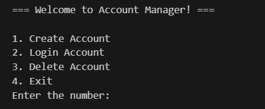

# مدير الحسابات
<div align="center">
  
 
  
  
  
  
  
   
  
  
  
  
  
  
  
</div>

## مقدمة


نظام بسيط لكن قوي لإدارة الحسابات مبرمج بلغة بايثون. هذا المشروع يوفر وظائف أساسية مثل إنشاء الحسابات، تسجيل الدخول مع تحديد عدد المحاولات، وإمكانية حذف الحسابات.

## الميزات

- **إنشاء حساب**: إنشاء حساب مستخدم جديد بسهولة باستخدام اسم مستخدم وكلمة مرور.
- **نظام تسجيل دخول آمن**: التحقق من كلمة المرور أثناء تسجيل الدخول.
- **تحديد عدد محاولات الدخول**: منع الهجمات باستخدام نظام يحدد عدد المحاولات الخاطئة.
- **حذف الحساب**: حذف الحساب بشكل دائم عند عدم الحاجة له.
- **واجهة استخدام سهلة**: واجهة تفاعلية عبر سطر الأوامر للتعامل بكل سهولة.

## التثبيت

```bash
# استنساخ الريبو
git clone https://github.com/turki013/Account-Manger.git

# الدخول على مجلد المشروع
cd Account-Manger

# تشغيل التطبيق
python src/main.py
```

## طريقة الاستخدام



بعد تشغيل التطبيق، راح تظهر لك قائمة بالخيارات التالية:

1. **إنشاء حساب**: إنشاء حساب مستخدم جديد.
2. **تسجيل الدخول**: تسجيل الدخول باستخدام البيانات الصحيحة.
3. **حذف حساب**: حذف الحساب بشكل نهائي.
4. **إعادة تعيين كلمة المرور**: تغيير كلمة المرور الحالية.
5. **استعادة كلمة المرور**: استعادة كلمة المرور في حال نسيانها.
6. **الخروج**: إغلاق التطبيق.

### إنشاء حساب

اختَر الخيار الأول من القائمة واتبع التعليمات لإدخال اسم المستخدم وكلمة المرور. النظام بيتأكد من مطابقة كلمة المرور مع التأكيد عشان يتم إنشاء الحساب بنجاح.

### تسجيل الدخول

اختَر الخيار الثاني وسجل دخولك باسم المستخدم وكلمة المرور. إذا غلطت أكثر من عدد المحاولات المسموح فيها، النظام بيقفل تسجيل الدخول مؤقتاً لحماية الحساب.

### حذف الحساب

اختَر الخيار الثالث واحذف الحساب بشكل نهائي بعد تأكيد الحذف.

## هيكلة المشروع

```
Account-Manger/
├── src/
│   └── main.py       # ملف التطبيق الرئيسي
├── Docs/             # مجلد التوثيق
├── pics/             # مجلد الصور
└── LICENSE           # ملف الرخصة
```

## ميزات الأمان

التطبيق فيه ميزة تحديد محاولات تسجيل الدخول الخاطئة للحماية ضد محاولات الاختراق. بعد عدة محاولات فاشلة، يتم قفل الحساب مؤقتًا.

## المساهمة

إذا حاب تطور المشروع أو تضيف له مميزات جديدة، تقدر تفتح Pull Request. المساهمات مرحب فيها دائمًا.

## الرخصة

هذا المشروع مرخص بموجب رخصة MIT. شوف ملف [LICENSE](LICENSE) لمزيد من التفاصيل.

## تواصل

لو عندك أي سؤال أو ملاحظة، تقدر تتواصل معي عن طريق فتح Issue على GitHub.

---

<div align="center">

**مصنوع بحب بواسطة [turki013](https://github.com/turki013)**

</div>

