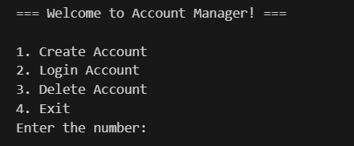

# Account Manager


<!-- Custom badges with better design and layout -->
<div align="center">
  
  
  
  
  
  
  
  
</div>


A simple yet powerful account management system built with Python. This project provides essential account management functionality including account creation, login authentication with attempt limiting, and account deletion.


## Features

- **Account Creation**: Easily create new user accounts with username and password
- **Secure Authentication**: Login system with password verification
- **Login Attempt Limiting**: Protection against brute force attacks with login attempt restrictions
- **Account Deletion**: Option to remove user accounts when no longer needed
- **User-Friendly Interface**: Simple command-line interface for easy interaction

## Installation

```bash
# Clone the repository
git clone https://github.com/turki013/Account-Manger.git

# Navigate to the project directory
cd Account-Manger

# Run the application
python src/main.py
```

## Usage


After running the application, you'll be presented with a menu offering the following options:

1. **Create Account**: Set up a new user account with username and password
2. **Login Account**: Access your account with proper credentials
3. **Delete Account**: Remove your account from the system
4. **Exit**: Close the application

### Creating an Account

Select option 1 and follow the prompts to enter your desired username and password. The system will verify that your password matches the confirmation and create your account.

### Logging In

Select option 2 and enter your credentials. The system includes a security feature that limits login attempts to prevent unauthorized access.

### Deleting an Account

Select option 3 and confirm your decision to permanently remove your account from the system.

## Project Structure

```
Account-Manger/
├── src/
│   └── main.py       # Main application file
├── Docs/             # Documentation
├── pics/             # Images and screenshots
└── LICENSE           # MIT License
```

## Security Features

This account manager implements a login attempt limiting system to protect against brute force attacks. After multiple failed login attempts, the system will temporarily lock access to the account.

## Contributing

Contributions are welcome! Feel free to submit a Pull Request.

## License

This project is licensed under the MIT License - see the [LICENSE](LICENSE) file for details.

## Stats

<div align="center">
  
  
  
</div>

## Contact

If you have any questions or feedback, please feel free to reach out or open an issue on GitHub.

---

<div align="center">
  
**Made with ❤️ by [turki013](https://github.com/turki013)**

</div>
